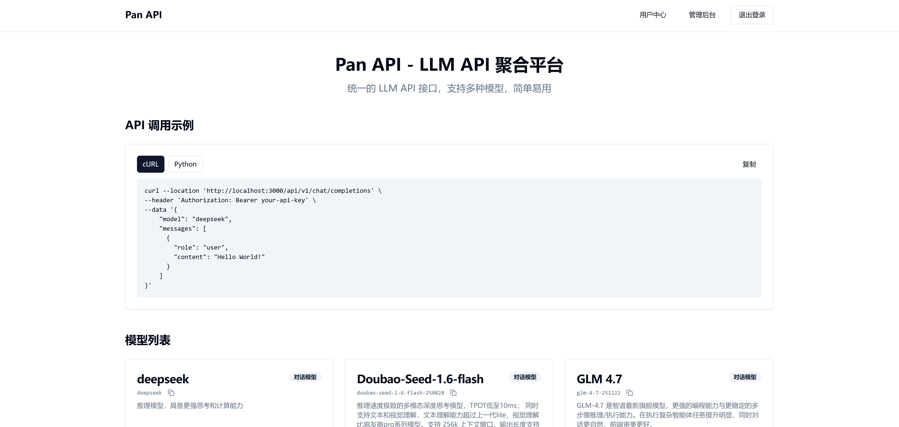

<h1 align="center"> pan-api 🚀</h1>


> 高性能多模型统一调度网关
> 基于 Java 构建的下一代大模型聚合平台。提供统一的标准接口，实现全球主流大模型（LLM）的快速集成、流量调度与资源监控，助力企业构建稳定的 AI 中枢。


**开发中，请不要直接在生产环境使用**

🌟 觉得不错？请给我一个 Star！
pan-api 正处于从 0 到 1 的全速进化期。

你的每一个 Star 都是我项目的动力源泉！它不仅是对代码的认可，更是对我不断完善“下一代 AI 中枢”的巨大鼓励。

如果你认可这个方向，或者它曾给你带来一点启发，请顺手点亮右上角的小星星，这对项目的成长至关重要！



## TODO List
+ [x] 支持DeepSeek
+ [x] 支持豆包(火山引擎)
+ [ ] 支持通义千问
+ [ ] 支持文心一言
+ [ ] 重写调度策略
  + [ ] 重新编写路由策略
  + [ ] 多 Key 的负载均衡和配额限流
+ 调整前端样式
+ [ ] 引入 CI & CD, 自动生成 & 校验 docs/openapi.json
[ ] 接入支付: 支持微信支付、支持
+ [ ] 测试用例覆盖
+ [ ] 跑通支付链路
  + [x] 用户管理页面, 提供手动调整余额功能
  + [ ] 提供兑换卡功能
  + [ ] 接入微信支付
+ 稳定性建设
  + [ ] 重试策略
  + [ ] 超时
  + [ ] 限流
  + [ ] fallback
- response也拆成common和deepseek、openai的
- venderType重构
- 清除所有Mysql NOW()

# 部署

## docker-compose部署

### 1. 配置环境变量

复制环境变量示例文件(.env.example)并修改：

```bash
cp .env.example .env
```

编辑 `.env` 文件，设置以下关键配置：

- `MYSQL_ROOT_PASSWORD`: MySQL root 密码
- `MYSQL_PASSWORD`: 数据库用户密码
- `JWT_SECRET`: JWT 密钥（建议使用强随机字符串）
- `SPRING_DATASOURCE_URL`: 数据库连接 URL（Docker Compose 中使用 `mysql` 作为主机名）
- `SPRING_DATASOURCE_USERNAME`: 数据库用户名
- `SPRING_DATASOURCE_PASSWORD`: 数据库密码

### 2. 启动所有服务

```bash
# 启动服务
docker-compose up -d

# 查看部署状态
docker-compose ps

# 停止服务
docker-compose down
```

### 3. 访问服务

- **前端**: http://localhost:8080
- **后端 API**: http://localhost:8546
- **Swagger UI**: http://localhost:8546/swagger-ui/index.html
- **Actuator Health**: http://localhost:8546/actuator/health


